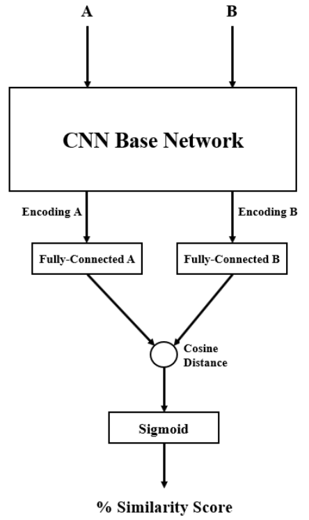

## Overview
In this project, classifiers have been developed for 1) product category and 2) product classifiction in grocery store applications. With product category classification, images are classified with labels corresponding to generic food categories found in grocery stores (i.e. cereal, coffee, tea, etc.), whereas product classification labels images with specific product names (i.e. Kellog's Cereal, Folger's coffee, etc.).

The contents of this repository are as follows:
- scripts: python scripts that train and test both product / product category classifiers using Keras with TensorFlow backend
- data: 
  - product category: Freiburg Groceries [1]
  - product: zip files corresponding to product images taken in a laboratory environment 
- results: sample images and tables that show results of various architecture and hyperparameter choices
- weights: sample weights that can be used to evaluate trained models

## Product Category Classification
### Architecture
A transfer learning approach is employed for product classfication that combines a pre-trained base network with new fully-connected (FC) layers. The base network acts as a feature extractor, generating a downsampled feature map which is then classified over *n* product categories by the new FC layers.

Keras' built-in MobileNet[2] pre-trained model with ImageNet weights is used as the base network for the product category classifier. MobileNet's average pooling, FC and softmax layers are removed and replaced with a stack of global average pooling > FC > softmax layers, where the new softmax layer corresponds to the 25 classes of [1].

The end-end architecture is summarized below:

| Layer | Filter Shape | Output Shape |
| ----  |--------------|--------------|
|Input  |             |224x224x3|
|**Base Network**| | |
|Convolution|3x3x3x32 |112x112x32|
|Depthwise Convolution|3x3x32 dw |112x112x32|
|Pointwise Convolution|1x1x32x64 |112x112x64|
|Depthwise Convolution|3x3x64 dw |56x56x64|
|Pointwise Convolution|1x1x64x128 |56x56x128|
|Depthwise Convolution|3x3x128 dw |56x56x128|
|Pointwise Convolution|1x1x128x128 |56x56x128|
|Depthwise Convolution|3x3x128 dw  |28x28x128|
|Pointwise Convolution|1x1x128x256 |28x28x256|
|Depthwise Convolution|3x3x256 dw  |28x28x128|
|Pointwise Convolution|1x1x256x256 |28x28x256|
|Depthwise Convolution|3x3x256 dw  |14x14x256|
|Pointwise Convolution|1x1x256x512 |14x14x512|
|5x Depthwise & Pointwise Convolutions|3x3x512 & 1x1x512x512 |14x14x512|
|Depthwise Convolution|3x3x512 dw  |7x7x512|
|Pointwise Convolution|1x1x512x1024 |7x7x1024|
|Depthwise Convolution|3x3x512 dw   |7x7x512|
|Pointwise Convolution|1x1x512x1024 |7x7x1024|
|Depthwise Convolution|3x3x1024 dw   |7x7x1024|
|Pointwise Convolution|1x1x1024x1024 |7x7x1024|
|**New Layers** | | |
|Global Average Pooling|Global Pool 7x7x1024|1x1x1024|
|FC|1x1x1024|1x1x1x2048|1x1x2048|
|Softmax|1x1x2048x25|1x1x25|

Please note that the choice of base network is flexible; users can replace the MobileNet model with other pre-trained models that are available in Keras, such as Inception-v3[3] and Inception-ResNet-v2[4].
 
### Training
The new FC layers of the above architecture are trained on a modified version of the Freiburg Groceries [1] dataset. [See here](product-classification/data/product_category/README.md) for more information.

The product category classifier is trained using the following hyperparameters: 

- loss function: multi-class cross entropy loss
- optimizer: RMS_prop
- number of epochs: 100
- batch size: 32
- learning rate: 0.001

To address overfitting, L2 regularization with a weight decay value of 0.0001 is applied to the network's final softmax layer.

## Product Classification Using Siamese Networks
### Architecture
A siamese network is trained to classify the similarity between two images. With respect to grocery store product classification, a similarity classification can be used to match product images recorded in-store with images in an offline store database. An overview of the network is shown below:

The network receives an input pair of A and B images, consisting of either 'similar' or dissimilar' products. For similar product pairs, a label of 1 is used, whereas dissimilar products are labelled as 0. The siamese network first uses a shared base network to generate encodings for both A and B images. These encodings are then compared with each other using a cosine distance similarity metric: 

d(A,B) = A.B / ||A|| ||B||

The calculated similarity is then classified using a sigmoid layer. 

For this implementation, the MobileNet base network is reused from the previous product category classifier. Additionally, experiments have been conducted using alternative similarity metrics, such as L1 and L2 distances.

### Training 

The siamese network is trained on a custom dataset created in a laboratory environment. [See here](product-classification/data/product/README.md) for more information. The transfer learning approach previously used for product category training is also adopted here, where only the new FC and sigmoid layer weights are learned during training.

Pairs of similar and dissimilar classes are created online from the initial train and validation sets. To create dissimilar pairs, an image of class *c*  is paired randomly with an image belonging to any one of the *n−1* remaining classes, while similar pairs are generated by grouping the *ith* and (*𝑖+1)th* images of class *c* together. The resultant pair datasets consist of 884 training pairs and 364 validation pairs, which approximately maintains the 70% / 30% split from the original dataset. 

The following hyperparameters are used during training: 

- loss function: binary cross entropy loss
- optimizer: RMS_prop
- number of epochs: 100
- batch size: 32
- learning rate: 0.001

## References
[1]: P. Jund, N. Abdo, A. Eitel, and W. Burgard, “The Freiburg Groceries Dataset,” 2016.

[2]: G. Howard et al., “MobileNets: Efficient Convolutional Neural Networks for Mobile
Vision Applications,” 2017.

[3]: C. Szegedy, V. Vanhoucke, S. Ioffe, J. Shlens, and Z. Wojna, “Rethinking the Inception
Architecture for Computer Vision,” 2015.

[4]: C. Szegedy, S. Ioffe, V. Vanhoucke, and A. Alemi, “Inception-v4, Inception-ResNet and
the Impact of Residual Connections on Learning,” 2016.

[5]: K. He, X. Zhang, S. Ren, and J. Sun, “Deep Residual Learning for Image Recognition,” in
2016 IEEE Conference on Computer Vision and Pattern Recognition (CVPR), 2016, pp.
770–778.
