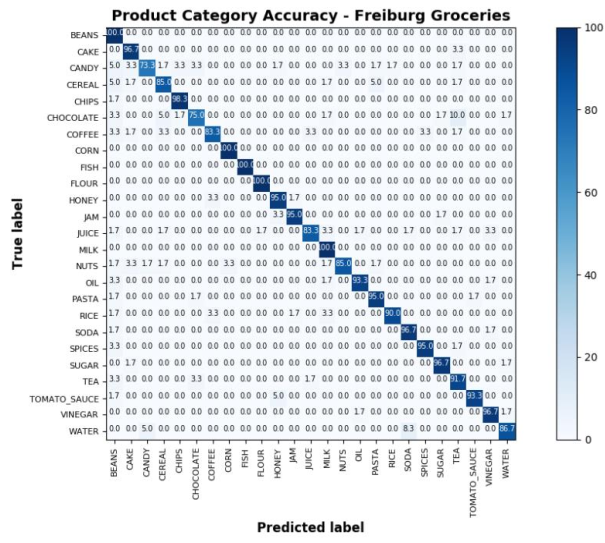
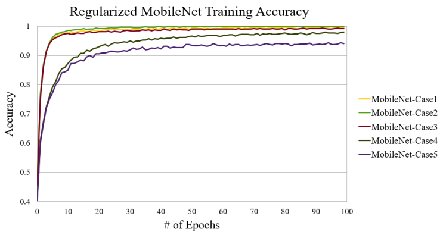
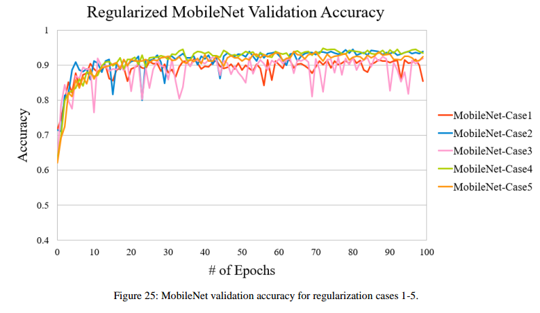

## Product Category Classification
On Freiburg Groceries, MobileNet achieved overall training, validation and test accuracies of 99.99%, 93.89% and 92.60% respectively. The accuracy per class on the test set is shown in the confusion matrix below.

The model had perfect classification accuracies of 100% for the categories beans, corn, fish, flour and milk, while its lowest accuracies corresponded to the candy (73.3%) and chocolate (75%) categories.

### Regularization Studies
Additional experiments were performed to explore how various regularization strategies affected the model's 
training and validation accuracies. In total, 5 methods were applied to the model:

|Case|Regularization Method(s)|
|----|-------------------------|
|1|No Regularization|
|2|L2 applied to softmax layer|
|3|L2 applied to FC + softmax layers|
|4|Dropout added before FC layers|
|5|Case 3 + Case 4|

For each case in the above table, new classifiers were trained with the specified regularization method. Training and validation accuracies for all 5 cases are shown below.

In Case 1, the model’s training accuracy converged to 100%, while its validation accuracy only achieved 85.5%. When L2 regularization was added to the softmax layer in Case 2, the model’s validation accuracy increased to approximately 94%, reducing the variance to approximately 6%. The addition of L2 regularization on the first FC layer did not affect the model’s variance significantly, with the training and validation accuracies decreasing to 99% and 92% respectively. The introduction of dropout in Case 4 resulted in the first substantial decrease in training accuracy from Case 2, while maintaining an equivalent validation accuracy of 94%. This effect was compounded further in Case 5, where dropout was combined with the previous L2 regularization in Case 3. The model’s overall variance was approximately 2%,
however this improvement in variance was a result of the model’s training accuracy decreasing from 98% in Case 4 to 94% in Case 5. 

Overall, the results in Cases 1-5 demonstrate that while the model’s variance was improved
through the additional regularization in Cases 4 and 5, this came at the cost of a significantly decreased training accuracy.

## Product Classification
